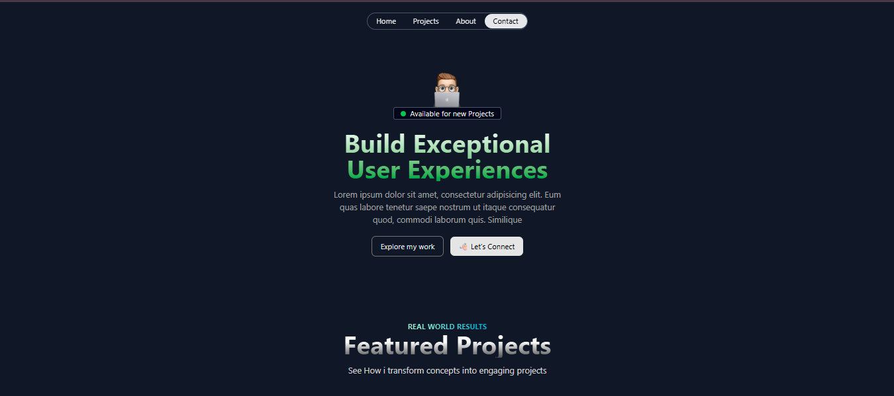

# 🌐 `Portfolio Website`

A modern, responsive personal portfolio website built using **`HTML5`** and **`Tailwind CSS`**. It features clean design, smooth responsiveness, and showcases `personal projects` with descriptions and images.

---

## ✨ `Features`

- 💻 **Fully Responsive Design** — Works across Various devices `(mobile, tablet, desktop)`
- 🧭 **Interactive Navigation** — `Simple` and `intuitive layout`
- 🖼 **Project Showcase** — Highlight your work with `descriptions` and `visuals`
- 📬 **Contact Section** — Reach out via clearly visible contact area `(no JS form logic)`

---

## 🛠 `Technologies Used`

- **HTML5**
- **Tailwind CSS v4+**
- **Custom CSS** `(for additional styling)`

---

## 🚀 `Getting Started`

To run the portfolio locally:

1. **Clone the Repository**

   ```bash
   git clone https://github.com/yourusername/your-repo-name.git

   cd your-repo-name
   ```

2. **Open the `index.html` file in a web browser**

## 📦 `Tools` & `Extensions` Recommended

👨‍💻 Code Editor: Visual Studio Code Editor

🎨 Tailwind CSS IntelliSense: `Autocompletion` and `hover preview` of Tailwind classes.

🧼 Prettier: `Code formatter` for consistent formatting.

🌐 Live Server: `Auto-reload browser` on file save.

📦 Tailwind CLI v4+: Used for `utility-first` CSS build.

❄️ Post Css : Extension for `tailwincdCss`

## 📄 `Screenshot`



## `License`

This project is licensed under the MIT License - see the [LICENSE.md](LICENSE.md) file for details

## 🙏 `Acknowledgments`

- [Tailwind CSS](https://tailwindcss.com/)
- [Placehold](https://placehold.co/) for the placeholder images
